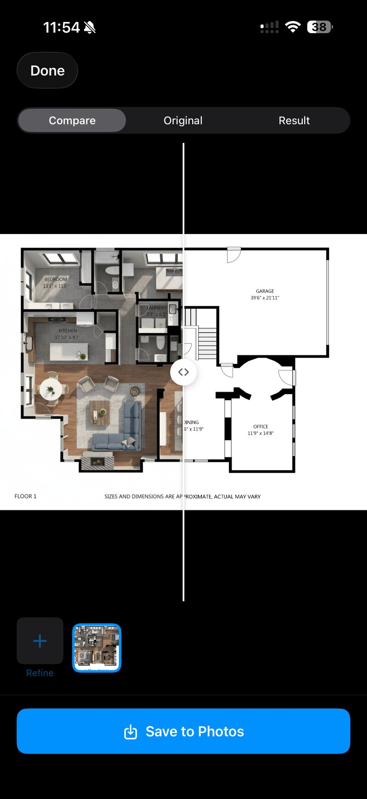
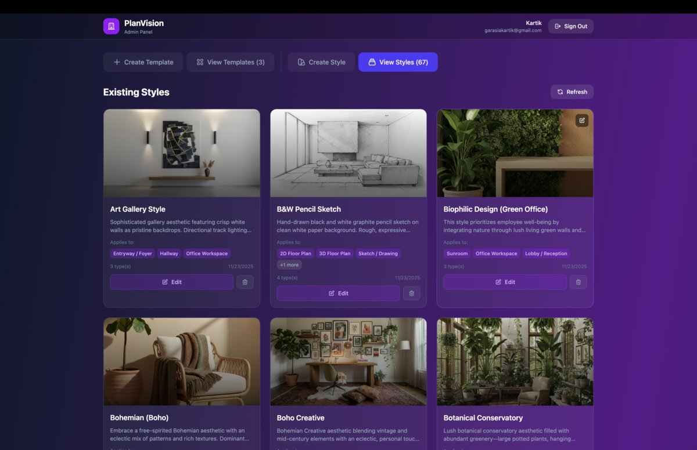
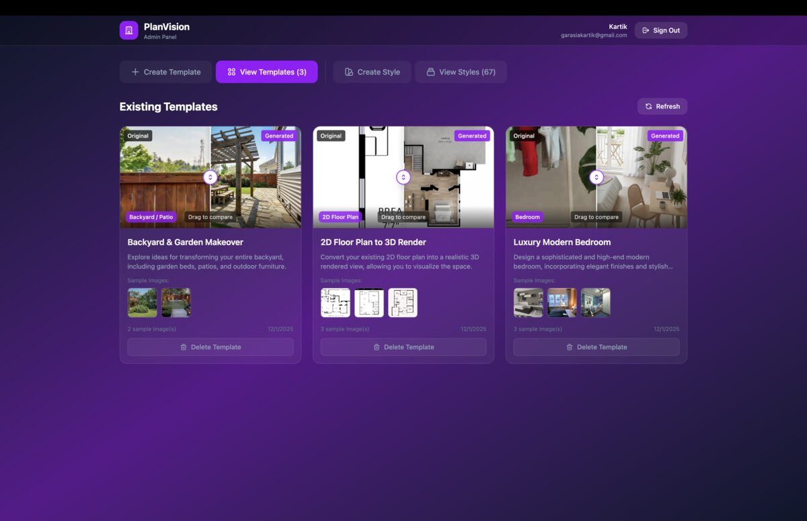
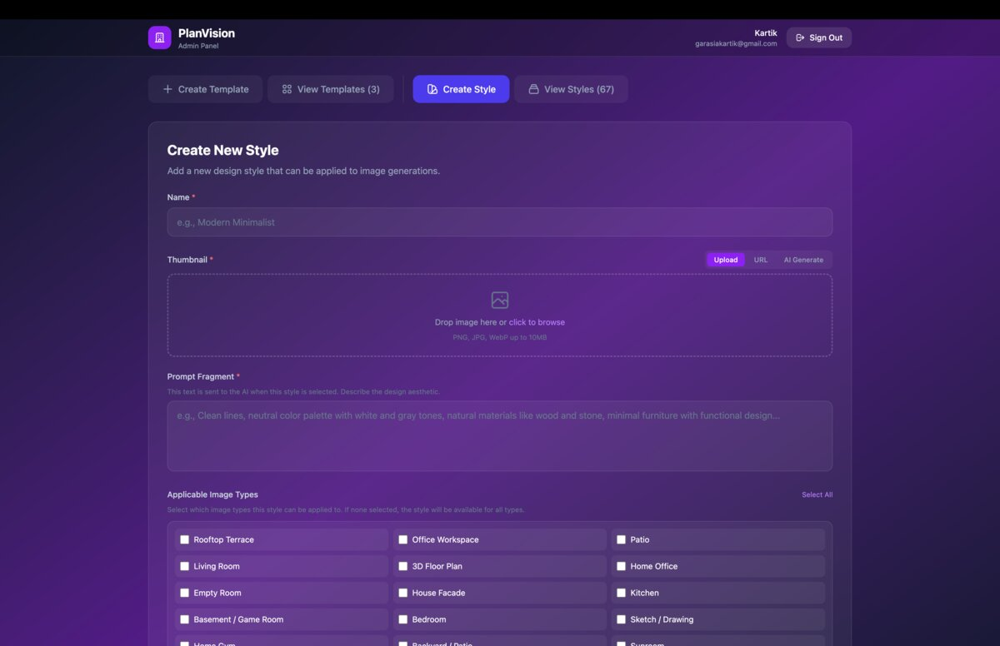

# PlanVision

<p align="center">

</p>

AI-powered architectural design and visualization platform. Upload floor plans or interior photos and see them rendered in different artistic styles using Google's Gemini AI.

## Demo

### Onboarding & Style Selection

https://github.com/kartik1225/planvision-ai/raw/main/docs/videos/onboarding.mp4

### Floor Plan to 3D Render

https://github.com/kartik1225/planvision-ai/raw/main/docs/videos/floor_plan_render.mp4

### Exterior Design Workflow

https://github.com/kartik1225/planvision-ai/raw/main/docs/videos/exterior_workflow.mp4

## Admin Dashboard

Manage styles, templates, and AI configurations through the admin panel.

<p align="center">


</p>
<p align="center">

</p>

### Admin Demo

https://github.com/kartik1225/planvision-ai/raw/main/docs/admin/admin-demo.mp4

## Features

- Upload floor plans or interior photos
- Choose from multiple design styles (Modern, Scandinavian, Industrial, etc.)
- AI-powered rendering using Google Gemini
- Save and manage design projects
- Export generated designs

## Architecture

```
plan_vision/
├── plan_vision/              # iOS SwiftUI App
├── plan_vision_backend/      # NestJS API Server
└── planvision_admin/         # Admin Dashboard (React)
```

## Tech Stack

### Backend
- **Framework**: NestJS 11 + TypeScript
- **Database**: PostgreSQL + Prisma
- **Auth**: Better Auth (email/password + Google OAuth + Apple Sign-In)
- **AI**: Google Gemini API
- **Storage**: Google Cloud Storage

### iOS App
- **Framework**: SwiftUI
- **Architecture**: Clean Architecture + MVVM
- **Networking**: URLSession-based HTTP client

### Admin Dashboard
- **Framework**: React + TypeScript
- **Build Tool**: Vite

## Getting Started

### Prerequisites

- Node.js 20+
- pnpm
- PostgreSQL
- Xcode 15+ (for iOS development)
- Google Cloud account
- Google Gemini API key

### Backend Setup

1. Navigate to the backend directory:
   ```bash
   cd plan_vision_backend
   ```

2. Install dependencies:
   ```bash
   pnpm install
   ```

3. Copy environment template and configure:
   ```bash
   cp .env.example .env
   # Edit .env with your credentials
   ```

4. Set up the database:
   ```bash
   pnpm prisma:generate
   pnpm prisma:migrate
   ```

5. Start the development server:
   ```bash
   pnpm start:dev
   ```

The API will be available at `http://localhost:3000`. View API documentation at `http://localhost:3000/docs`.

### iOS App Setup

1. Open `plan_vision/plan_vision.xcodeproj` in Xcode

2. Update `Config.swift` with your backend server address:
   ```swift
   static let host = "your-server-address"
   ```

3. Build and run on simulator or device

### Admin Dashboard Setup

1. Navigate to the admin directory:
   ```bash
   cd planvision_admin
   ```

2. Install dependencies:
   ```bash
   pnpm install
   ```

3. Start the development server:
   ```bash
   pnpm dev
   ```

## Environment Variables

See `plan_vision_backend/.env.example` for required environment variables:

| Variable | Description |
|----------|-------------|
| `DATABASE_URL` | PostgreSQL connection string |
| `BETTER_AUTH_SECRET` | JWT signing secret |
| `GOOGLE_OAUTH_CLIENT_ID` | Google OAuth client ID |
| `GOOGLE_OAUTH_CLIENT_SECRET` | Google OAuth client secret |
| `GCS_BUCKET` | Google Cloud Storage bucket name |
| `GCP_PROJECT_ID` | Google Cloud project ID |
| `GEMINI_API_KEY` | Google Gemini API key |
| `PEXELS_API_KEY` | Pexels API key (for templates) |

## API Endpoints

| Endpoint | Description |
|----------|-------------|
| `GET /` | Health check |
| `POST /api/auth/sign-in/email` | Email login |
| `POST /api/auth/sign-up/email` | Email registration |
| `GET /users/me` | Current user profile |
| `POST/GET/PATCH/DELETE /projects` | Project CRUD |
| `POST /input-images/upload` | Upload image |
| `GET /styles` | List design styles |
| `GET /image-types` | List image categories |
| `GET /docs` | Swagger API documentation |

## Contributing

See [CONTRIBUTING.md](CONTRIBUTING.md) for guidelines.

## License

This project is licensed under the MIT License - see the [LICENSE](LICENSE) file for details.
